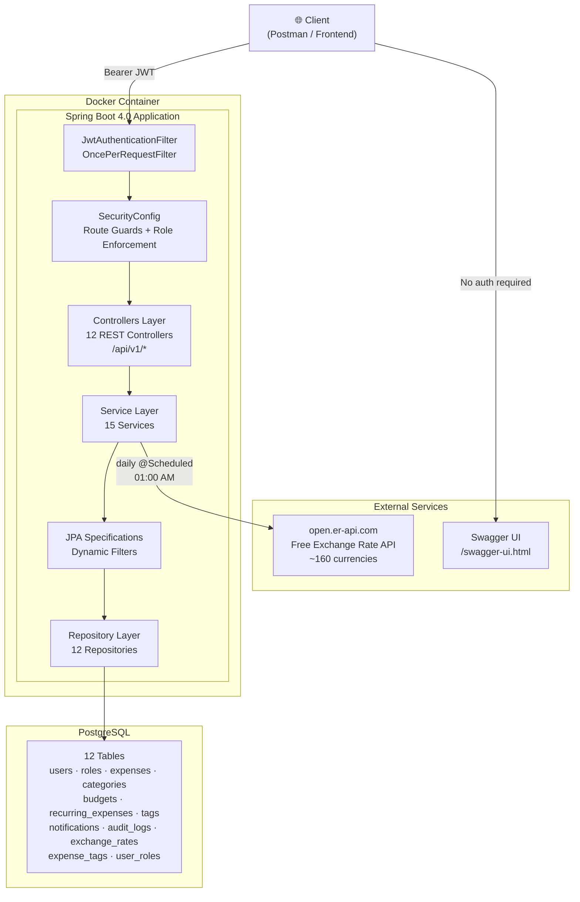
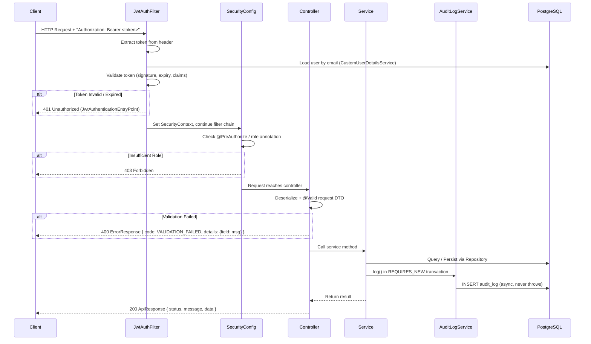
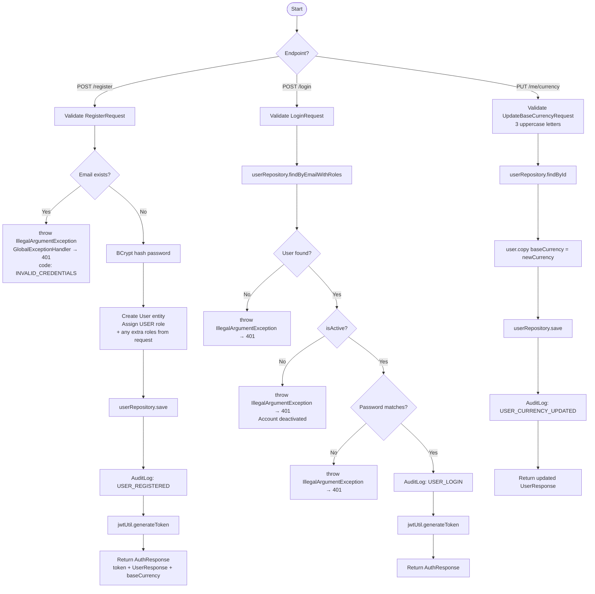
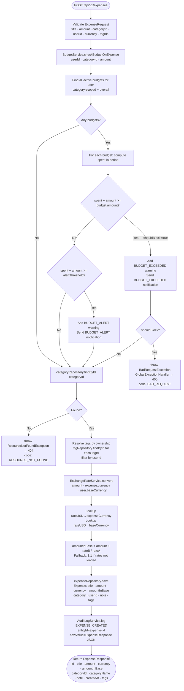
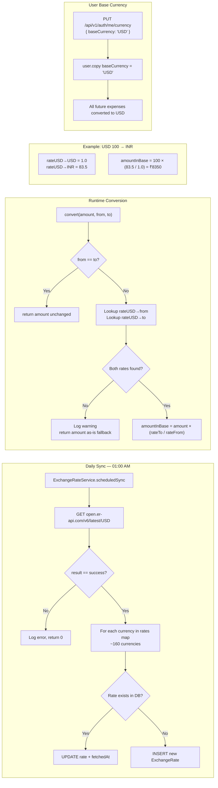
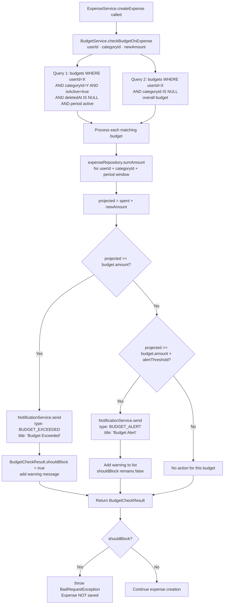
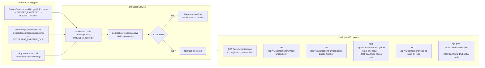
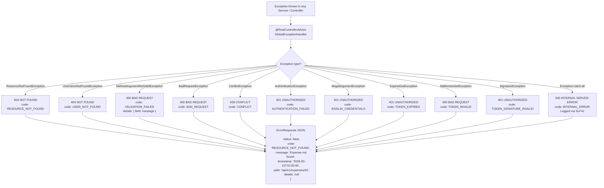

# Expense Tracker — Flow Diagrams

> All diagrams use [Mermaid](https://mermaid.js.org/) syntax — rendered natively in GitHub, GitLab, JetBrains IDEs, and VS Code (with the Mermaid Preview extension).

---

## 1. High-Level Architecture



---

## 2. Request Lifecycle (Every Authenticated Request)



---

## 3. Authentication Flow



---

## 4. Expense Creation Flow (Full Pipeline)



---

## 5. Multi-Currency Flow



---

## 6. Scheduled Jobs Timeline

```mermaid
gantt
    title Daily Scheduled Jobs
    dateFormat HH:mm
    axisFormat %H:%M

    section Budget Reset
    BudgetService.resetPeriodicBudgets()     : 00:00, 5m

    section Recurring Expenses
    RecurringExpenseService.processRecurring() : 00:05, 15m

    section Exchange Rates
    ExchangeRateService.scheduledSync()       : 01:00, 10m
```

```mermaid
flowchart TD
    subgraph Job1["00:00 — Budget Period Reset"]
        J1A[Find all active budgets\nwhere period window has elapsed] --> J1B[For each: advance startDate\nby one period length]
        J1B --> J1C[budgetRepository.save]
    end

    subgraph Job2["00:05 — Recurring Expense Processor"]
        J2A["findAllDueToday\nnextDueDate <= today\nAND isActive = true\nAND endDate >= today OR null"] --> J2B[For each entry independently]
        J2B --> J2C[Build ExpenseRequest\ntitle · amount · categoryId · userId]
        J2C --> J2D[expenseService.createExpense\nbudget check + currency convert + audit]
        J2D --> J2E[AuditLog: EXPENSE_AUTO_CREATED]
        J2E --> J2F[Send RECURRING_EXPENSE_DUE notification]
        J2F --> J2G{endDate passed?}
        J2G -->|Yes| J2H[set isActive = false]
        J2G -->|No| J2I[Advance nextDueDate by frequency]
        J2I --> J2J[recurringExpenseRepository.save]
        J2B -->|Exception for one entry| J2K[Log error, continue to next entry]
    end

    subgraph Job3["01:00 — Exchange Rate Sync"]
        J3A["GET open.er-api.com/v6/latest/USD"] --> J3B[Parse rates map ~160 currencies]
        J3B --> J3C[Upsert each rate in exchange_rates table]
        J3C --> J3D[Log count updated]
        J3A -->|Network/API error| J3E[Log error, swallow exception\nApp continues normally]
    end
```





---

## 7. Budget Enforcement Flow



---

## 8. Notification Flow



---

## 9. Tags / Labels Flow

```mermaid
flowchart TD
    subgraph CRUD["Tag CRUD — /api/v1/tags"]
        CT[POST /tags\nTagRequest: name · color] --> CT1{name exists\nfor this user?}
        CT1 -->|Yes| CT2[throw ConflictException → 409\ncode: CONFLICT]
        CT1 -->|No| CT3[tagRepository.save\nTag: name · color · userId · createdAt]
        CT3 --> CT4[AuditLog: TAG_CREATED]
        CT4 --> CT5[Return TagResponse]

        UT[PUT /tags/{id}\nTagRequest: name · color] --> UT1[findByIdAndUserId\nOwnership enforced]
        UT1 -->|Not found| UT2[throw ResourceNotFoundException → 404]
        UT1 -->|Found| UT3{Name changed\nAND new name exists?}
        UT3 -->|Yes| UT4[throw ConflictException → 409]
        UT3 -->|No| UT5[tag.copy name · color]
        UT5 --> UT6[tagRepository.save]
        UT6 --> UT7[AuditLog: TAG_UPDATED]

        DT[DELETE /tags/{id}] --> DT1[findByIdAndUserId]
        DT1 --> DT2[tagRepository.deleteById\nCASCADES to expense_tags]
        DT2 --> DT3[AuditLog: TAG_DELETED]
    end

    subgraph Attach["Tags on Expenses"]
        EA[ExpenseRequest includes\ntagIds: List&lt;Long&gt;] --> EA1[resolveTagsForUser\nfor each tagId: findById\nfilter: tag.userId == caller userId]
        EA1 --> EA2[expense.tags = resolvedTags\nSaved via ManyToMany EAGER\nexpense_tags join table]
    end

    subgraph Filter["Filter Expenses by Tags"]
        FF[POST /api/v1/expenses/filter\nExpenseFilterRequest.tagIds = 1,3] --> FF1[filterByTagIds Specification\nINNER JOIN expense_tags ON tag.id IN tagIds\nquery.distinct = true]
        FF1 --> FF2[Returns only expenses\nhaving ALL specified tags]
    end
```

---

## 10. Report Generation Flow

```mermaid
flowchart TD
    subgraph DB_Reports["DB-Backed Reports (ReportRepository)"]
        R1["GET /summary\nJPQL: SUM amount · COUNT · AVG"] --> RR[ReportRepository\nnative/JPQL queries]
        R2["GET /category-wise\nGROUP BY category"] --> RR
        R3["GET /date-wise\nGROUP BY DATE(created_at)"] --> RR
        R4["POST /custom\ndate range + category filter\nvia Specifications"] --> RR
        R5["GET /trends?months=6\nEXTRACT YEAR/MONTH\nwith category breakdown"] --> RR
        R6["GET /budget-performance\nLive spent vs limit per budget"] --> BS[BudgetService\n.getBudgetStatus per budget]
    end

    subgraph Memory_Reports["In-Memory Reports (ReportService)"]
        R7["GET /insights"] --> INS[Load all user expenses\nfrom expenseRepository]
        INS --> INS1[This month vs last month totals]
        INS --> INS2[Velocity: INCREASING / DECREASING / STABLE]
        INS --> INS3[Avg daily spend — last 30 days]
        INS --> INS4[Highest spend day — last 30 days]
        INS --> INS5[Biggest single expense — all time]
        INS --> INS6[Most used category — by count]

        R8["GET /top-expenses?limit=10&categoryId="] --> TOP[Load expenses by userId\noptional category Specification]
        TOP --> TOP1[Sort by amount DESC]
        TOP1 --> TOP2[Take first N — capped 1-100]
    end

    subgraph Export["File Export"]
        R9["GET /export?format=csv"] --> EXP[ExportService\n@Transactional readOnly=true]
        R10["GET /export?format=pdf"] --> EXP
        EXP --> EXP1[findByUserId sorted by createdAt DESC]
        EXP1 -->|csv| EXP2[Apache Commons CSV\nContent-Type: text/csv\nfilename: expenses.csv]
        EXP1 -->|pdf| EXP3[OpenPDF table\nIndigo header · alternating rows\nfilename: expenses.pdf]
        EXP2 --> EXPAUD[AuditLog: REPORT_EXPORTED]
        EXP3 --> EXPAUD
    end
```

---

## 11. Audit Logging Flow

```mermaid
flowchart LR
    subgraph Writers["Who Writes Audit Logs"]
        W1[ExpenseService\nCREATED · UPDATED · DELETED · AUTO_CREATED]
        W2[BudgetService\nCREATED · UPDATED · DELETED]
        W3[RecurringExpenseService\nCREATED · UPDATED · DELETED · PROCESSED]
        W4[CategoryService\nCREATED · UPDATED · DELETED]
        W5[AuthService\nUSER_REGISTERED · USER_LOGIN · ROLE_ASSIGNED\nUSER_CURRENCY_UPDATED]
        W6[NotificationService\nNOTIFICATION_READ · NOTIFICATION_DELETED]
        W7[ExportService\nREPORT_EXPORTED]
        W8[TagService\nTAG_CREATED · UPDATED · DELETED]
    end

    subgraph AuditLogService["AuditLogService.log()"]
        AL1["@Transactional(REQUIRES_NEW)\nOwn transaction — never blocked by caller rollback"]
        AL2[Capture IP: X-Forwarded-For → remoteAddr → null for scheduler]
        AL3["Serialize oldValue / newValue to JSON\nvia ObjectMapper (Jackson 3.x — tools.jackson)"]
        AL4[auditLogRepository.save]
        AL5{Exception?}
        AL5 -->|Yes| AL6[Log error, swallow\nCaller is NEVER affected]
        AL5 -->|No| AL7[AuditLog persisted]
    end

    subgraph Endpoints["Read Endpoints — /api/v1/audit-logs"]
        E1[GET / — All logs paginated — ADMIN]
        E2[GET /me — My audit trail — Authenticated]
        E3[GET /user/{userId} — Any user — SUPER_ADMIN]
        E4[GET /entity/{type}/{id} — Entity history — ADMIN]
        E5[GET /action/{action} — Filter by action — ADMIN]
    end

    W1 & W2 & W3 & W4 & W5 & W6 & W7 & W8 --> AL1
    AL1 --> AL2 --> AL3 --> AL4 --> AL5
    AL7 --> Endpoints
```

---

## 12. Entity Relationship Diagram

```mermaid
erDiagram
    USER {
        bigint id PK
        string email UK
        string name
        string password
        boolean isActive
        string baseCurrency
        timestamp createdAt
        timestamp updatedAt
    }

    ROLE {
        bigint id PK
        string name
    }

    USER_ROLES {
        bigint user_id FK
        bigint role_id FK
    }

    CATEGORY {
        bigint id PK
        string name
        string description
        boolean isGlobal
        bigint user_id FK_nullable
    }

    EXPENSE {
        bigint id PK
        string title
        double amount
        string currency
        double amount_in_base
        bigint category_id FK
        bigint user_id FK
        string note
        timestamp createdAt
    }

    TAG {
        bigint id PK
        string name
        string color
        bigint user_id FK
        timestamp createdAt
    }

    EXPENSE_TAGS {
        bigint expense_id FK
        bigint tag_id FK
    }

    BUDGET {
        bigint id PK
        bigint user_id FK
        bigint category_id FK_nullable
        double amount
        string period
        date startDate
        date endDate
        double alertThreshold
        boolean isActive
        timestamp deletedAt
        timestamp createdAt
    }

    RECURRING_EXPENSE {
        bigint id PK
        bigint user_id FK
        bigint category_id FK
        string title
        double amount
        string frequency
        date nextDueDate
        date endDate
        boolean isActive
        string note
        timestamp deletedAt
        timestamp createdAt
    }

    NOTIFICATION {
        bigint id PK
        bigint user_id FK
        string title
        string message
        string type
        boolean isRead
        string entityType
        bigint entityId
        timestamp createdAt
    }

    AUDIT_LOG {
        bigint id PK
        bigint user_id FK
        string action
        string entityType
        bigint entityId
        text oldValue
        text newValue
        string ipAddress
        timestamp createdAt
    }

    EXCHANGE_RATE {
        bigint id PK
        string base_currency
        string target_currency
        double rate
        timestamp fetchedAt
    }

    USER ||--o{ USER_ROLES : "has"
    ROLE ||--o{ USER_ROLES : "assigned via"
    USER ||--o{ EXPENSE : "owns"
    USER ||--o{ BUDGET : "has"
    USER ||--o{ RECURRING_EXPENSE : "has"
    USER ||--o{ NOTIFICATION : "receives"
    USER ||--o{ AUDIT_LOG : "generates"
    USER ||--o{ TAG : "owns"
    CATEGORY ||--o{ EXPENSE : "categorizes"
    CATEGORY ||--o{ BUDGET : "scopes"
    CATEGORY ||--o{ RECURRING_EXPENSE : "categorizes"
    EXPENSE ||--o{ EXPENSE_TAGS : "tagged via"
    TAG ||--o{ EXPENSE_TAGS : "applied via"
```

---

## 13. Error Response Flow



---

## 14. Security Layer Decision Tree

```mermaid
flowchart TD
    REQ[Incoming HTTP Request] --> PUB{Is path public?}

    PUB -->|Yes — /api/v1/auth/register\n/api/v1/auth/login\n/api/v1/auth/roles\n/swagger-ui/**\n/v3/api-docs/**\n/actuator/health| PASS[Pass through — no auth needed]

    PUB -->|No| TOKEN{Authorization\nheader present?}
    TOKEN -->|Missing| R401A[401 Unauthorized\nJwtAuthenticationEntryPoint]

    TOKEN -->|Present| VALID{JWT valid?\nsignature + expiry}
    VALID -->|Expired| R401B[401 — TOKEN_EXPIRED]
    VALID -->|Malformed| R400[400 — TOKEN_INVALID]
    VALID -->|Bad signature| R401C[401 — TOKEN_SIGNATURE_INVALID]
    VALID -->|Valid| LOAD[Load User from DB\nSet SecurityContext]

    LOAD --> ROLE{Controller annotation?}
    ROLE -->|@IsAuthenticated| OK[Any authenticated user — allow]
    ROLE -->|@IsAdmin| CHKADMIN{Has ADMIN role?}
    ROLE -->|@IsSuperAdmin| CHKSUPER{Has SUPER_ADMIN role?}
    ROLE -->|@IsModerator| CHKMOD{Has MODERATOR role?}
    ROLE -->|@IsAccountant| CHKACC{Has ACCOUNTANT role?}

    CHKADMIN -->|Yes| OK
    CHKADMIN -->|No| R403[403 Forbidden]
    CHKSUPER -->|Yes| OK
    CHKSUPER -->|No| R403
    CHKMOD -->|Yes| OK
    CHKMOD -->|No| R403
    CHKACC -->|Yes| OK
    CHKACC -->|No| R403

    OK --> CTRL[Controller → Service → Repository]
```

---

## 15. Complete API Endpoint Map

```mermaid
mindmap
  root((API v1))
    Auth
      POST /register
      POST /login
      GET /me
      POST /assign-roles
      GET /roles
      PUT /me/currency
    Expenses
      GET / paginated
      POST / create
      GET /{id}
      PUT /{id}
      DELETE /{id}
      GET /search
      GET /filter/category
      GET /filter/amount
      GET /filter/date-range
      POST /filter advanced
    Categories
      Admin /admin/categories
        POST
        PUT /{id}
        DELETE /{id}
      User /categories
        GET
        POST
        PUT /{id}
        DELETE /{id}
    Budgets
      POST
      GET
      GET /{id}/status
      PUT /{id}
      DELETE /{id}
    RecurringExpenses
      POST
      GET
      GET /{id}
      PUT /{id}
      DELETE /{id}
    Tags
      POST
      GET
      GET /{id}
      PUT /{id}
      DELETE /{id}
    Reports
      GET /summary
      GET /category-wise
      GET /date-wise
      POST /custom
      GET /trends
      GET /budget-performance
      GET /insights
      GET /top-expenses
      GET /export csv or pdf
    ExchangeRates
      GET / list rates
      GET /convert
      POST /sync ADMIN
    Notifications
      GET / paginated
      GET /unread
      GET /unread/count
      PUT /{id}/read
      PUT /read-all
      DELETE /{id}
    AuditLogs
      GET / ADMIN
      GET /me
      GET /user/{id} SUPER_ADMIN
      GET /entity/{type}/{id}
      GET /action/{action}
    Dashboard
      GET /
```
